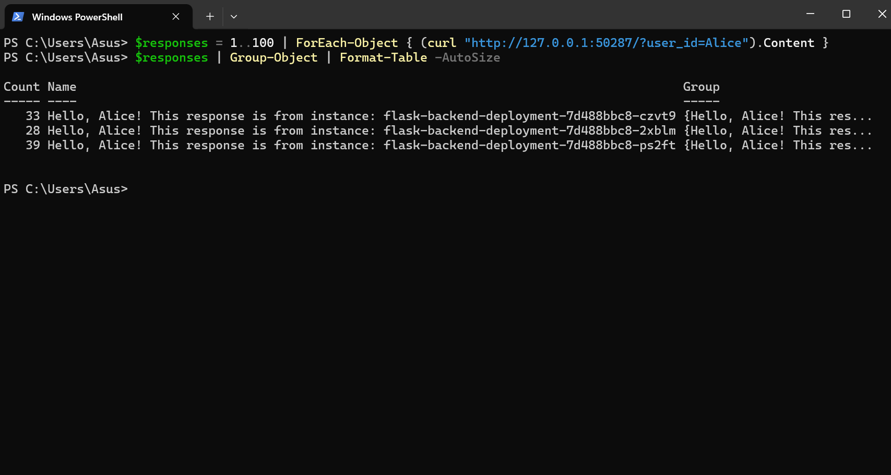

# Lab: Deploy Flask Backend with Python Load Balancer on Kubernetes

## Objectives

- Deploy multiple services in Kubernetes for a distributed backend application.
- Set up a Python-based load balancer to route traffic across backend instances.
- Use `minikube service` for accessing services if NodePort is unavailable.
- Perform load testing with Apache Benchmark to evaluate traffic distribution.

